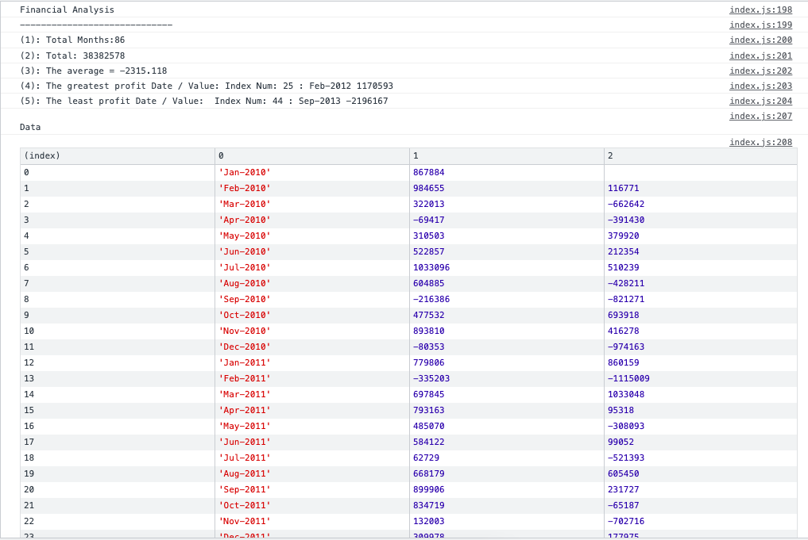

# Console-Finances

## Description 

This is a financial anaylsis calculator, developed in javascipt. 

The program runs 5 calculations:
1. The total number of enteries/months
2. The total sum of the enteries 
3. The changes in profit/losses for each month, and then calculate the average change.
4. The month and value with the greatest profit recorded
5. The month and value with the greatest lost recorded

### Summary of learnings

- Working with nested arrays 
- Learnt how to select an item within 2d array. syntax: array[row][col]
- Became comfortable with while and for loops to count interations and increase the index number by 1 to meet the length needed.
- Review code at the end to ensure that it is consist, leaving appropriate notes so I can read the code at a later date.
- Became more comfortable with debugging code and isolating errors in order to search and find the right questions and answers. 

## Application

This is a visual of the application

## Credits

Support from: 
https://www.javascripttutorial.net/javascript-multidimensional-array/#:~:text=To%20access%20an%20element%20of,element%20of%20the%20inner%20array. 

## License
Please see Licence doc.